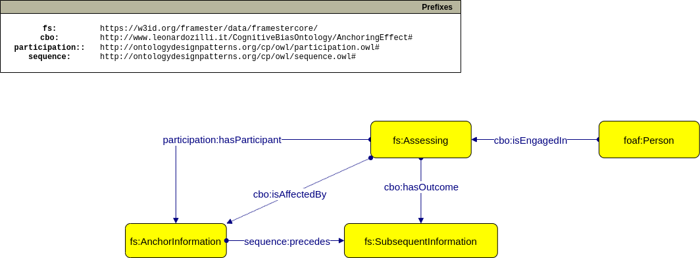

# ⚓ Anchoring effect

[**OWL File of the Ontology**](https://www.leonardozilli.it/CognitiveBiasOntology/AnchoringBias.owl)

<figure><figcaption><p>UML of the Anchoring effect ontology</p></figcaption></figure>

#### Consulted Bibliography:

These resources were consulted to compile a first understanding of the bias' behavior.

1. Furnham, Adrian & Boo, Hua. (2011). A Literature Review of the Anchoring Effect. The Journal of Socio-Economics. 40. 35-42. 10.1016/j.socec.2010.10.008.

**Initial AI Ontology Prompts:**

_What is the anchoring effect?_

The anchoring effect, also known as anchoring bias, is a cognitive bias that describes the human tendency to rely too heavily on the first piece of information encountered (the "anchor") when making decisions or judgments. This bias occurs because the initial information acts as a mental reference point or starting point, and subsequent decisions or judgments are then adjusted relative to that anchor.

_Give me an example scenario of the anchoring effect_

During a job interview, the interviewer asks the candidate about their salary expectations. The first number mentioned by the interviewer, whether high or low, serves as an anchor for the candidate's response. The candidate's salary expectations tend to cluster around the initial anchor, potentially influencing the subsequent salary negotiation

_Give me a short user story based on the previous scenario._

As a seasoned professional actively seeking new career opportunities, I recently found myself excited about a job opening at a prominent company. The position aligns perfectly with my skill set and passion, making it an ideal next step in my career.

I prepared extensively for the job interview, meticulously researching the company's values, culture, and industry trends. During the interview, I confidently answered questions about my experience and demonstrated my expertise in various aspects of the role.

As the interview progressed, the interviewer broached the topic of salary expectations. My heart raced slightly, as I understood the importance of this moment. Drawing on my prior research and market knowledge, I was ready to communicate my worth effectively.

To my surprise, the interviewer was the first to mention a salary figure. She presented a number that was higher than I had anticipated, which immediately served as an anchor in my mind. My initial reaction was to feel a sense of relief that their proposed range aligned with my expectations.

However, I knew the significance of the anchoring effect, and I didn't want to let it unduly influence my response. Remaining composed, I acknowledged their offer graciously and took a moment to gather my thoughts. I then confidently expressed my appreciation for their proposal while calmly discussing my market research and achievements, which justified a salary at the higher end of their range.

Throughout the negotiation, I ensured my communication was clear and backed by strong evidence of my contributions in past roles. By doing so, I was able to advocate for my true value and expertise, steering the discussion away from the initial anchor.

In the end, the interviewer acknowledged my arguments and agreed to adjust their initial offer to better reflect my qualifications and experience. We reached a mutually beneficial salary agreement that not only met my expectations but also affirmed their recognition of my skills.

Walking out of the interview room, I felt a sense of accomplishment and relief. The anchoring effect could have easily led me astray, but through my preparation and composure, I successfully navigated the salary negotiation. This experience taught me the importance of self-awareness during crucial moments and the value of presenting a well-structured case backed by data and achievements. With newfound confidence, I eagerly await the opportunity to contribute my expertise to this exceptional company.

***

**Competency Questions:**

Q.  What salaries were discussed in the negotiation?

```sparql
SELECT ?salary
	WHERE { ?salary a cbo:Information }
```

Q.  What was the salary initially proposed by the interviewer?

```sparql
SELECT ?salary
	WHERE { ?salary a cbo:Anchorinformation }
```

A. Which was the salary rebutted by the interviewee?

```sparql
SELECT ?salary
	WHERE { ?salary a cbo:SubsequentInformation }
```

***

#### Framester Frames adopted:

* [Information](https://w3id.org/framester/data/framestercore/Memory)
* [Assessing](https://w3id.org/framester/data/framestercore/Assessing)

#### Content ODPs used:

* [Experience and Observation](http://ontologydesignpatterns.org/wiki/Submissions:Experience\_%26\_Observation)
* [Participation](http://ontologydesignpatterns.org/wiki/Submissions:Participation)
* [Sequence](http://ontologydesignpatterns.org/wiki/Submissions:Sequence)

### Visualize the ontology with [LODE](https://leonardozilli.it/CognitiveBiasOntology/docs/AnchoringBias)
