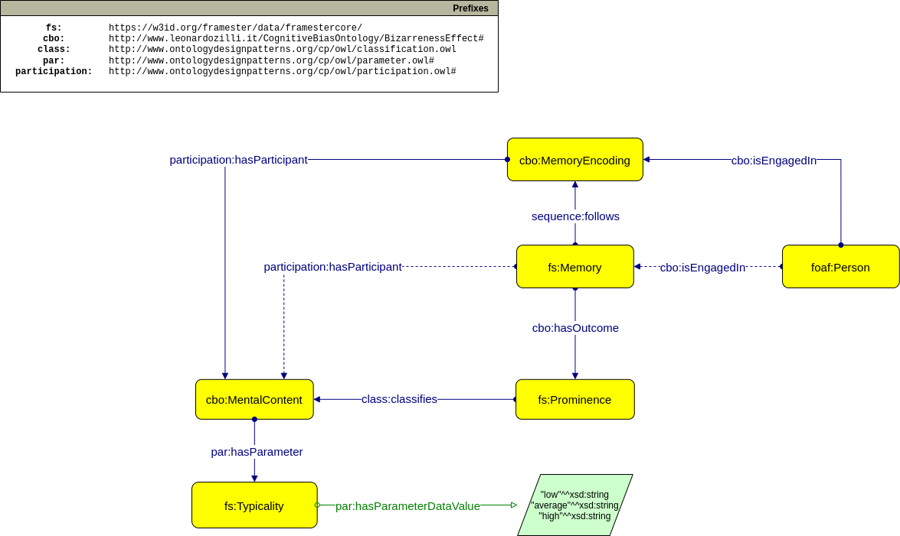

# ⁉ Bizarreness effect

[**OWL File of the Ontology**](https://www.leonardozilli.it/CognitiveBiasOntology/BizarrenessEffect.owl)

<figure><figcaption><p>UML of the Bizarreness effect ontology</p></figcaption></figure>


#### Consulted Bibliography:

These resources were consulted to compile a first understanding of the bias' behavior.

1. Geraci, L., McDaniel, M.A., Miller, T.M. _et al._ The bizarreness effect: evidence for the critical influence of retrieval processes. _Mem Cogn_ 41, 1228–1237 (2013). https://doi.org/10.3758/s13421-013-0335-4
2. Besken M, Mulligan NW. The bizarreness effect and visual imagery: No impact of concurrent visuo-spatial distractor tasks indicates little role for visual imagery. J Exp Psychol Learn Mem Cogn. 2022 Sep;48(9):1281-1295. doi: 10.1037/xlm0001038. Epub 2021 Aug 5. PMID: 34351199.
3. McDaniel MA, Einstein GO, DeLosh EL, May CP, Brady P. The bizarreness effect: it's not surprising, it's complex. J Exp Psychol Learn Mem Cogn. 1995 Mar;21(2):422-435. doi: 10.1037//0278-7393.21.2.422. PMID: 7738508.

**Initial AI Ontology Prompts:**

_What is the bizarreness effect?_

The bizarreness effect is a cognitive phenomenon that suggests that people tend to have better memory recall for unusual or bizarre information compared to more ordinary or mundane information. It is often associated with the encoding and retrieval processes of memory.

_Give me an example scenario of the bizarreness effect_

A newspaper publishes an article that includes a bizarre or unexpected element. Out of all the articles in the newspaper, readers are more likely to remember and share such article due to its intriguing and unusual nature.

_Give me a short user story based on the previous scenario._

As a curious reader of the local newspaper, I browse through the latest articles, looking for interesting news and stories to read. Among the many articles, three headlines catch my attention:

1. "New Park Opening in the City"
2. "Local School Wins Science Fair"
3. "Mysterious UFO Sightings Reported Over the City"

Intrigued by the bizarre and unexpected element, I click on the "Mysterious UFO Sightings Reported Over the City" article to read more. As I start reading, the story unfolds with witness accounts describing strange lights and unidentified flying objects hovering over the city. The article goes on to quote experts, presenting conflicting theories and scientific explanations. The intriguing details and unexpected nature of the story captivate my attention, making it stand out from the other articles in the newspaper.

Feeling excited about the unusual story, I share it on my social media accounts. I can't help but think that my friends and followers will also find it captivating and might have their interpretations or experiences to share.

In the following days, I notice that the UFO sighting article becomes a hot topic of discussion among my friends and social media connections. Some are sharing similar experiences, while others are engaging in lively debates about the existence of extraterrestrial life. It seems that the article's bizarre and unexpected element has left a lasting impression on others, just as it did on me.

As I continue reading the newspaper, I appreciate the variety of news and stories presented, but it's clear that the "Mysterious UFO Sightings Reported Over the City" article stands out as one of the most memorable pieces. The bizarreness effect has certainly worked its magic, making this article a topic of conversation and sparking the imagination of readers like me. It's fascinating to see how such a unique and unexpected story can have a significant impact, driving curiosity and discussions beyond the pages of the newspaper.

***

**Competency Questions:**

Q. Which articles did the reader read?

A. "New Park Opening in the City", "Local School Wins Science Fair", "Mysterious UFO Sightings Reported Over the City"

```sparql
SELECT ?article
	WHERE { ?article a cbo:MentalContent }
```

Q. Which is the most bizarre article?

A. The article titled "Mysterious UFO Sightings Reported Over the City."

```sparql
SELECT ?article
	WHERE { ?article a cbo:BizarreContent }
```

Q. Which article is the reader most likely to remember?

A. The article titled "Mysterious UFO Sightings Reported Over the City."

```sparql
SELECT ?article
	WHERE { ?article class:isClassifiedBy fs:Prominence}
```

***

#### Framester Frames adopted:

* [Memory](https://w3id.org/framester/data/framestercore/Memory)
* [Prominence](https://w3id.org/framester/data/framestercore/Prominence)
* [Typicality](https://w3id.org/framester/data/framestercore/Typicality)

#### Content ODPs used:

* [Classification](http://ontologydesignpatterns.org/wiki/Submissions:Classification)
* [Parameter](http://ontologydesignpatterns.org/wiki/Submissions:Parameter)
* [Participation](http://ontologydesignpatterns.org/wiki/Submissions:Participation)
* [Sequence](http://ontologydesignpatterns.org/wiki/Submissions:Sequence)

### Visualize the ontology with [LODE](https://leonardozilli.it/CognitiveBiasOntology/docs/BizarrenessEffect)

