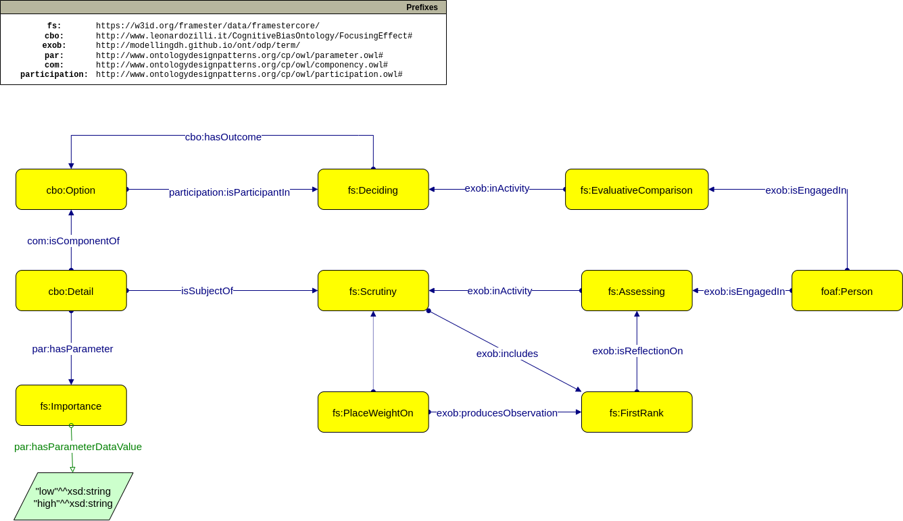

# 🔎 Focusing effect

[**OWL File of the Ontology**](https://www.leonardozilli.it/CognitiveBiasOntology/FocusingEffect)

<figure><figcaption><p>UML of the Focusing effect ontology</p></figcaption></figure>

#### Consulted Bibliography:

These resources were consulted to compile a first understanding of the bias' behavior.

1. Krueger, Alan & Schkade, David & Schwarz, Norbert & Stone, Arthur. (2006). Would You Be Happier If You Were Richer? A Focusing Illusion. Science (New York, N.Y.). 312. 1908-10. 10.1126/science.1129688.

**Initial AI Ontology Prompts:**

_What is the ofcusing effect bias?_

The focusing effect bias, also known as the focusing illusion, refers to a cognitive bias that occurs when individuals place excessive importance on a single aspect of an event or situation while neglecting other relevant factors. It involves overestimating the influence or impact of one particular factor and underestimating the importance of other variables.

_Give me an example scenario of the focusing effect bias_

A consumer chooses a smartphone based solely on the camera quality, without considering other important features like battery life, durability, or software performance.

_Give me a short user story based on the previous scenario._

As a passionate photography enthusiast, my smartphone plays a significant role in capturing and preserving life's precious moments. I yearn for a smartphone with an exceptional camera that can deliver high-quality images and videos. Thus, when I decide to upgrade my current device, camera quality is my primary focus.

I start my search by exploring various smartphone models that boast advanced camera features and innovative photography technology. I want to find a phone that excels in low-light conditions, offers optical image stabilization, and provides manual controls for creative expression.

Through research and reviews, I gather detailed information about each smartphone's camera capabilities. I'm thrilled to see some models featuring multiple lenses, AI-enhanced photography, and high-resolution sensors, which would significantly enhance my photography experience.

However, I remind myself not to get lost in the allure of exceptional camera quality alone. To ensure a well-rounded choice, I broaden my perspective and consider other essential features such as battery life, durability, and software performance.

A long-lasting battery is crucial, as it will enable me to capture photos and videos without worrying about frequent recharges during my photography outings. Additionally, I prioritize a durable and well-built device that can withstand my active lifestyle and occasional drops.

Lastly, I acknowledge the significance of smooth performance and user-friendly software. A seamless operating system and a responsive interface will aid in quickly accessing the camera and editing tools, optimizing my photography workflow.

As I compare various smartphone options side by side, I carefully weigh the trade-offs between camera quality and other features. Ultimately, I choose a smartphone that not only excels in camera performance but also aligns with my overall needs, striking the perfect balance between photographic prowess and everyday functionality. With my new smartphone, I'm now equipped to capture breathtaking images and tell visual stories like never before.

***

**Competency Questions:**

Q.  Which features does the smartphoneB have?

```sparql
SELECT ?feature
	WHERE { ?feature a cbo:Detail ;
			com:isComponentOf ?smartphone .
			FILTER (?smartphone = cbo:smartphoneB) }
```

Q.  How important is durability to the consumer?

```sparql
SELECT ?degree
	WHERE { ?feature a cbo:Detail ;
			par:hasParameter ?importance .
		?importance par:hasParameterDataValue ?degree
		FILTER (?feature = cbo:better_durability) }
```

Q.  Which smartphone is the consumer more likely to choose?

```sparql
SELECT ?smartphone
	WHERE { ?smartphone a cbo:DecisionOutcome }
```


***

#### Framester Frames adopted:

* [Deciding](https://w3id.org/framester/data/framestercore/Deciding)
* [Assessing](https://w3id.org/framester/data/framestercore/Assessing)
* [FirstRank](https://w3id.org/framester/data/framestercore/FirstRank)
* [EvaluativeComparison](https://w3id.org/framester/data/framestercore/EvaluativeComparison)
* [Scrutiny](https://w3id.org/framester/data/framestercore/Scrutiny)
* [Importance](https://w3id.org/framester/data/framestercore/Importance)
* [PlaceWeightOn](https://w3id.org/framester/data/framestercore/PlaceWeightOn)

#### Content ODPs used:

* [Experience and Observation](http://ontologydesignpatterns.org/wiki/Submissions:Experience\_%26\_Observation)
* [Participation](http://ontologydesignpatterns.org/wiki/Submissions:Participation)
* [Sequence](http://ontologydesignpatterns.org/wiki/Submissions:Sequence)

### Visualize the ontology with [LODE](https://leonardozilli.it/CognitiveBiasOntology/docs/FocusingEffect)
