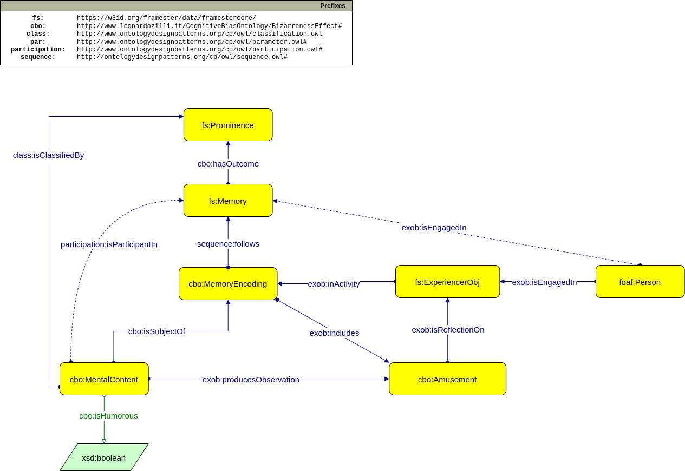

# 🤣 Humor effect

[**OWL File of the Ontology**](https://www.leonardozilli.it/CognitiveBiasOntology/HumorEffect.owl)

<figure><figcaption><p>UML of the Humor effect ontology</p></figcaption></figure>

#### Consulted Bibliography:

These resources were consulted to compile a first understanding of the bias' behavior.

1. Badli, Tunku & Dzulkifli, Mariam. (2013). The Effect of Humour and Mood on Memory Recall. Procedia - Social and Behavioral Sciences. 97. 252-257. 10.1016/j.sbspro.2013.10.230.
2. Carlson, Kieth. (2011). The impact of humor on memory: Is the humor effect about humor?. Humor - International Journal of Humor Research. 24. 10.1515/humr.2011.002.

**Initial AI Ontology Prompts:**

_What is the humor effect?_

The "humor effect" refers to a cognitive bias that suggests that humorous information is more easily remembered and recalled compared to non-humorous information. This bias suggests that people are more likely to remember information that is presented in a humorous or entertaining manner.

_Give me an example scenario of the humor effect_

A company creates a humorous television commercial for their product. The funny storyline and witty dialogue engage viewers, making the advertisement more memorable. As a result, consumers are more likely to remember the product and its key features when making purchasing decisions.

_Give me a short user story based on the previous scenario._

As a consumer, I sit down to watch my favorite TV show, and during the commercial break, a humorous advertisement catches my eye. The ad's funny storyline and witty dialogue instantly capture my attention and make me laugh. I find myself thoroughly entertained and engaged by the commercial's humor.

The advertisement cleverly weaves the product's key features into the humorous storyline, presenting them in a way that complements the humor rather than interrupting it. As a result, I can effortlessly remember the product's name and its distinctive attributes, even after the commercial has ended.

A few days later, while browsing online or visiting a store, I come across the product from the advertisement. I notice that the humorous commercial has left a lasting impact on me. The memory of the amusing storyline and the memorable product features come flooding back to my mind. The humor bias has influenced my memory positively, ensuring that the product stands out among the others I encounter.

Thanks to the humor bias in the advertisement, I feel more inclined to consider purchasing the product. The entertaining experience of watching the ad has created a positive association with the product in my mind. I confidently make my purchase, knowing that the humorous ad has played a crucial role in helping me remember the product and its unique benefits.

In this user story, the humor bias effectively engages the consumer and enhances their memory retention of the product and its features. The entertaining and humorous advertisement positively influences the consumer's decision-making process, leading to a favorable outcome for the company.

***

**Competency Questions:**

Q.  Which ads did the consumer watch?

A. "New Park Opening in the City", "Local School Wins Science Fair", "Mysterious UFO Sightings Reported Over the City"

```sparql
SELECT ?ad
	WHERE { ?ad a cbo:MentalContent }
```

Q. Which is the funniest ad?

A. The article titled "Mysterious UFO Sightings Reported Over the City."

```sparql
SELECT ?ad
	WHERE { ?ad a cbo:HumorousContent }
```

Q. Which ad is going to be better remembered?

A. The article titled "Mysterious UFO Sightings Reported Over the City."

```sparql
SELECT ?ad
	WHERE { ?ad class:isClassifiedBy fs:Prominence}
```

***

#### Framester Frames adopted:

* [Memory](https://w3id.org/framester/data/framestercore/Memory)
* [Prominence](https://w3id.org/framester/data/framestercore/Prominence)
* [ExperiencerObj](https://w3id.org/framester/data/framestercore/ExperiencerObj)

#### Content ODPs used:

* [Experience and Observation](http://ontologydesignpatterns.org/wiki/Submissions:Experience\_%26\_Observation)
* [Classification](http://ontologydesignpatterns.org/wiki/Submissions:Classification)
* [Parameter](http://ontologydesignpatterns.org/wiki/Submissions:Parameter)
* [Participation](http://ontologydesignpatterns.org/wiki/Submissions:Participation)
* [Sequence](http://ontologydesignpatterns.org/wiki/Submissions:Sequence)

### Visualize the ontology with [LODE](https://leonardozilli.it/CognitiveBiasOntology/docs/HumorEffect)

