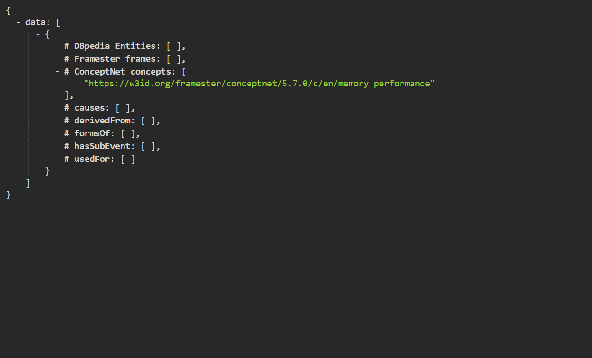

# ⚠ Problems Assesment

## Limitation of LLM (Large Language Model)

An early problem became apparent when we are initially using ChatGPT to generate a definition for each of our biases. The free version of the AI model was outdated in terms of information, and its knowledge became questionable as we detected flaws within the definition that the AI formulated. Therefore, we decided to 'feed' the AI our own definition of the biases first to ensure the information to stay updated.

<figure><figcaption>
An example of ChatGPT prompt for one of the bias definition
</figcaption></figure>

## LLM - User Story and CQs

The next problem we encountered was the difficulty in associating the user stories that we have gathered from the AI to the competency questions (**CQ**s) that was required by the eXtreme Design. To solve this, we wrote the CQs ourselves and analyzed whether the user stories could solve the questions or not.&#x20;

| Evan's Personal Comment                                                                                                                                                                                                                                                                                                             |
| ----------------------------------------------------------------------------------------------------------------------------------------------------------------------------------------------------------------------------------------------------------------------------------------------------------------------------------- |
| Personally, I found the user stories from the AI to be able to answer the CQs, and I was able to progress the project further. Furthermore, asking the AI to answer the CQs based on the previous user story its generated also proved to be fruitful, as it was capable of answering it as long as the answer is analyzed further. |

## Framester Frames' Limited Entities

Next challenge that we found is the problem of using Framester Frames to the ontologies that the AI had made. In the project, we are required to align existing entities at the Framester Frames within our own ontology using the [QUOKKA tool](http://etna.istc.cnr.it/quokka/concepts). We found our progress to be quite hindered by this predicament, as we found most of the AI-made ontology to be incompatible/unable to be aligned with any of the entities within Framester Frames.&#x20;

Upon further research, we found adequate amount of entities from the Framester Frames that we are able to integrate to our own ontologies, although the keyword need to be changed in order to conform with the chosen Framester Frames' entities. Furthermore, additional meeting with the supervisors of the projects explained that we should not limit ourselves to the Framester Frames.

<figure><figcaption>
Lack of Framester Frames for the specified keyword - "MemoryPerformance"
</figcaption></figure>

## Choosing The Appropriate ODPs

Another problem that we found is choosing the appropriate ODPs for each of our cognitive biases ontology. We found there are only few ODPs that correspond to the cognitive bias phenomenon, which corresponds to the field of Humanities, Psychology, and Social Studies.&#x20;

At first, we addressed this problem by choosing certain ODPs which fit our understanding of each biases that we are working on. A further meeting with Prof. Gangemi solved the problem further as he told us about the freedom of using multiple ODPs and integrating it in each of our ontologies. Therefore, four of the problems are able to be addressed to enable progress to our project.&#x20;

<figure><figcaption>
List of potential ODPs to be chosen.
</figcaption></figure>

## Closure Model

A future problem have also been identified in how to create a closure model to integrate all of our biases. Each of the group's member are currently using different ODPs since we have different ideas of how the ontologies can be developed from each of our picked cognitive biases.&#x20;

Currently, we decided to put that on hold as we are still processing our own biases at the present time. In our latest meeting, we have identified several solutions to the closure model, such as unifying our biases with one uniform ODPs as one possible solution.

## Summary

To summarize, here are the problems we face in the project, with checklists to keep track of them:

* [x] [**Limitation of LLM**](problems-assesment.md#limitation-of-llm-large-language-model) - Outdated knowledge for definition of biases. \
  _Solution: Write own definitions first and give it to the AI before generating user story._
* [x] [**Limitation of LLM**](problems-assesment.md#llm-user-story-and-cqs) - Associating AI-generated user stories with CQs can be difficult. \
  _Solution: Ask the AI the CQs based on the generated user stories._
* [x] [**Framester Frames' Limited Entities**](problems-assesment.md#framester-frames-limited-entities) - Inadequate choice of keywords.\
  _Solution: Compromise by not rigidly following the keywords, look for alternative entities._
* [x] [**Choosing The Appropriate ODPs**](problems-assesment.md#choosing-the-appropriate-odps) - Few appropriate ODPs can be chosen to create an ontology out of the cognitive biases.\
  _Solution: Use multiple ODPs is allowed, use only the appropriate properties for the ontologies._&#x20;
* [ ] [**Closure Model**](problems-assesment.md#closure-model) - Unifying all of the group's biases would pose a problem as each members are using different ODPs and properties to create the ontologies out of their chosen biases.\
  _Possible Solutions: Unify all of the biases under one ODP? / Create a custom ODP based on the ODPs that have been used in the entities by merging them all?_

